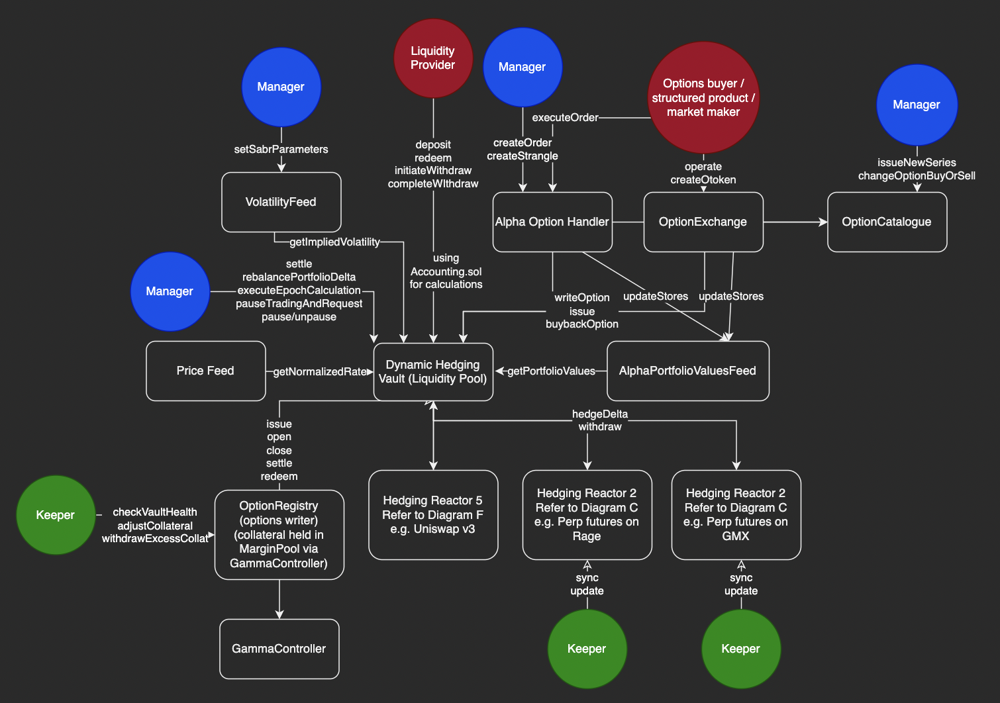

 

# The Dynamic Hedging Vault (DHV)

[Docs explaining the DHV](https://docs.rysk.finance/getting-started/dynamic-hedging-vault-dhv) 

[Medium article explaining the DHV](https://medium.com/@rysk-finance/looking-under-the-hood-of-rysks-dynamic-hedging-vault-e059e1b87e41)

The dynamic hedging vault is a product that issues options and trades other derivatives with the aim of generating yield and targeting delta 0 in order to achieve a market uncorrelated return stream. 

Users deposit a single collateral (USDC) into the vault (LiquidityPool) in exchange for shares, the flow follows a ["Mutual fund system"](https://bejewled-egret-22c.notion.site/Mutual-Fund-Mechamism-Explainer-768912673cf946f4a99c3b833d830389) whereby deposits and withdraws are queued and then completed after a certain epoch it has various inputs from oracles which are described in AlphaPortfolioValuesFeed.md and LiquidityPool.md. This collateral is used to collateralise or "short" options which are sold to any option buyer, the buyer pays a "premium" to buy an option, this premium represents the yield on collateral (but this yield comes at the risk of the options exposure, where if an option expires ITM it can result in a loss for the short position holder). A user might deposit into this vault to access high yields that are uncorrelated to the market. Users can withdraw at any time, this can be processed after an "epoch" completion so long as there is sufficient capital available.

Options buyers interact with the protocol in 2 ways, otc or exchange. 

OTC via the AlphaOptionHandler: This is a contract that is authorised to interact with options buying/selling functionality of the LiquidityPool. [Options buyers can "Execute custom orders".] which are created by managers, refer to AlphaOptionHandler.md.

Exchange via the OptionExchange: This is a contract that is authorised to interact with options buying/selling functionality of the LiquidityPool. It acts as an options exchange between the users and the dhv, users are able to buy options from the vault and sell options to the vault refer to OptionExchange.md. When users are buying options they can purchase these from the liquidityPool which will collateralise and sell these to the user. Options that users are able to purchase are defined in the OptionCatalogue which keeps record of options that have been approved for sale or purchase.


Options are priced by the BeyondPricer.sol described in BeyondPricer.md.

Then the liquidityPool will take the instruction from the handler, process it and pass it to the optionsRegistry for processing on the [opyn-rysk gamma protocol](https://github.com/rysk-finance/GammaProtocol) alongside any funds needed to collateralise the option positon if it is a write operation.

The pool can hedge its delta off using other derivatives such as perps or spot by using contracts known as hedging reactors these reactors take funds directly from the liquidityPool.


# total system - contracts are labelled with a star * is TO BE audited

```
contracts
├── libraries
│   ├── BlackScholes.sol
│   ├── CombinedActions.sol * 
│   ├── RyskActions.sol *
│   ├── SABR.sol *
│   ├── CustomErrors.sol
│   ├── NormalDist.sol
│   ├── OptionsCompute.sol *
│   ├── OpynInteractions.sol *
│   ├── AccessControl.sol
│   ├── SafeTransferLib.sol
│   └── Types.sol
├── Accounting.sol *
├── Authority.sol
├── LiquidityPool.sol *
├── OptionRegistry.sol *
├── AlphaOptionHandler.sol *
├── BeyondPricer.sol *
├── OptionCatalogue.sol *
├── OptionExchange.sol *
├── Protocol.sol
├── AlphaPortfolioValuesFeed.sol *
├── VolatilityFeed.sol *
└── PriceFeed.sol *
```