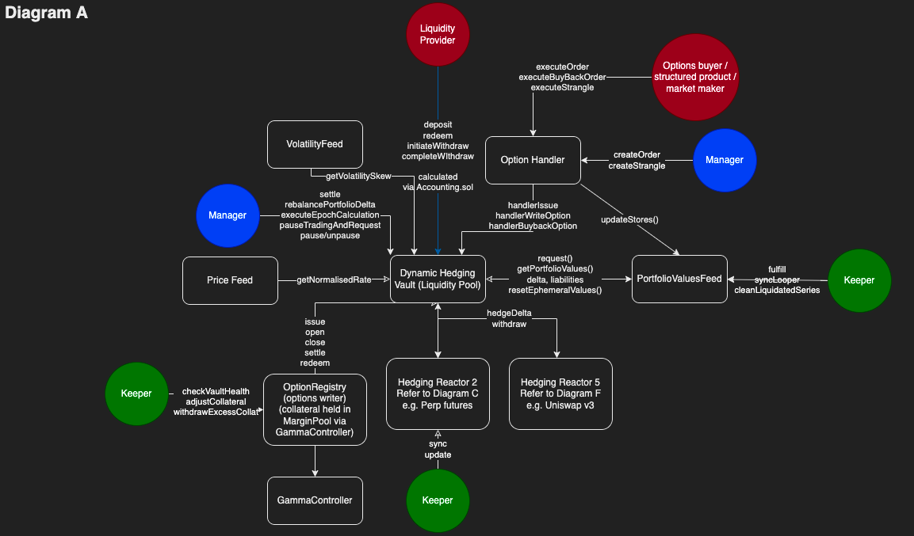

 

# The Dynamic Hedging Vault (DHV)

[Docs explaining the DHV](https://docs.rysk.finance/architecture/dynamic-hedging-vault-amm) 

[Medium article explaining the DHV](https://medium.com/@rysk-finance/looking-under-the-hood-of-rysks-dynamic-hedging-vault-e059e1b87e41)

The dynamic hedging vault is a product that issues options and trades other derivatives with the aim of generating yield and targeting delta 0 in order to achieve a market uncorrelated return stream. 

Users deposit a single collateral (USDC to begin with) into the vault (LiquidityPool) in exchange for shares, the flow follows a ["Mutual fund system" - like Ribbon's vault flow as opposed to Yearn's vault flow](https://bejewled-egret-22c.notion.site/Mutual-Fund-Mechamism-Explainer-768912673cf946f4a99c3b833d830389) whereby deposits and withdraws are queued and then completed after a certain epoch it has various inputs from oracles which are described in OracleFeeds.md . This collateral is then used to collateralise or "short" options which are sold to any option buyer, the buyer pays a "premium" to buy an option, this premium represents the yield on collateral (but this yield comes at the risk of the options exposure, where if an option expires ITM it can result in a loss for the short position holder). A user might deposit into this vault to access high yields that are uncorrelated to the market. Users can withdraw at any time, this can be processed after an "epoch" completion so long as there is sufficient capital available.

Options buyers interact with the OptionHandler. This is a contract that is authorised to interact with options buying/selling functionality of the LiquidityPool. [Options buyers can "Execute custom orders".](https://bejewled-egret-22c.notion.site/Liquidity-Pool-Options-Interactions-Alpha-d1c0f1b745cc4712a2ed3de9f93d4d1e) The handler transfers the premia directly from the user to the liquidityPool, the premia is priced according to various parameters which are done off chain, the prices will most likely be based on an in house volatility surface. Then the liquidityPool will take the instruction from the handler, process it and pass it to the optionsRegistry for processing on the [opyn-rysk gamma protocol](https://github.com/rysk-finance/GammaProtocol) alongside any funds needed to collateralise the option position if it is a write operation.

The pool can hedge its delta off using other derivatives such as perps or spot by using contracts known as hedging reactors.

## Relevant Contracts to rysk alpha

```
contracts
├── hedging
│   ├── PerpHedgingReactor.sol
│   └── UniswapV3HedgingReactor.sol
├── interfaces
│   ├── AddressBookInterface.sol
│   ├── IAuthority.sol
│   ├── AggregatorV3Interface.sol
│   ├── GammaInterface.sol
│   ├── IERC20.sol
│   ├── IOptionRegistry.sol
│   ├── ILiquidityPool.sol
│   ├── IHedgingReactor.sol
│   ├── IMarginCalculator.sol
|   ├── IPortfolioValuesFeed.sol
│   └── IOracle.sol
├── libraries
│   ├── BlackScholes.sol
│   ├── CustomErrors.sol
│   ├── NormalDist.sol
│   ├── OptionsCompute.sol
│   ├── OpynInteractions.sol
│   ├── AccessControl.sol
│   ├── SafeTransferLib.sol
│   └── Types.sol
├── tokens
│   └── ERC20.sol
├── Authority.sol
├── LiquidityPool.sol
├── OptionRegistry.sol
├── AlphaOptionHandler.sol
├── Protocol.sol
├── AlphaPortfolioValuesFeed.sol
├── VolatilityFeed.sol
└── PriceFeed.sol
```
